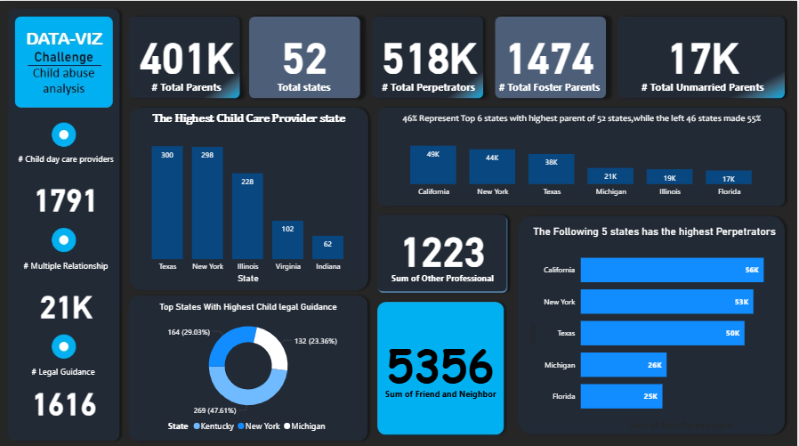

# Child Abuse Report – Power BI Dashboard

A professional **Power BI dashboard** designed to analyze and visualize data related to **child abuse cases**. This report provides meaningful insights through interactive charts, maps, and KPIs to support awareness, decision-making, and preventive measures.

---

## 📌 Overview

The **Child Abuse Report** project is a Power BI template (`.pbit`) that transforms raw data into an insightful, interactive dashboard.
It highlights key trends, demographics, and geographical distributions of child abuse cases for better analysis and reporting.

Repository contents:

* `reportOne.pbit` — Power BI template file.
* `img1.png` — Sample screenshot of the dashboard.
* `README.md` — Documentation file.

---

## ✨ Features

* **Interactive Dashboard Pages** — Multiple report pages offering different perspectives (by region, by age group, by type of abuse).
* **Key Metrics & KPIs** — Highlights of total reports, confirmed cases, pending investigations, and incident ratios.
* **Filters & Slicers** — Dynamic filtering by time period, region, gender, age, and type of abuse.
* **Trend Analysis** — Time series charts to monitor abuse case trends (monthly, quarterly, yearly).
* **Geographical Insights** — Map visuals displaying distribution of cases across locations.
* **Demographic Breakdown** — Analysis by age groups, gender, and socio-economic context.
* **Cross-Filtering & Drill-Through** — Select data points to update related visuals instantly.
* **Reusable Template** — `.pbit` file allows quick adaptation for different datasets.

---

## 🖼️ Dashboard Preview

A sample view of the **Child Abuse Report Dashboard**:

---

## 🚀 How to Use

1. Install **[Power BI Desktop](https://powerbi.microsoft.com/desktop/)** (latest version recommended).
2. Open the `reportOne.pbit` file in Power BI Desktop.
3. Connect your dataset (Excel, CSV, database, or API).
4. Validate the data model to ensure proper field mapping.
5. Customize visuals (colors, titles, layouts) as needed.
6. Add or adjust dashboard pages if required.
7. Publish to **Power BI Service** or export as **PDF/PowerPoint** for sharing.

---

## 🔮 Future Enhancements

* Add a **data dictionary** with detailed field descriptions.
* Implement **alerts/conditional formatting** for abnormal spikes.
* Improve **accessibility** (alt text, high-contrast visuals).
* Optimize for **mobile view**.
* Strengthen **data privacy** by excluding sensitive information.
* Provide **exportable summaries** for stakeholders.

---

## 🤝 Contribution & License

* Currently, no license is defined. Adding one (e.g., MIT, GPL) is recommended for clarity on usage.
* Contributions are welcome through **Issues** and **Pull Requests**.

